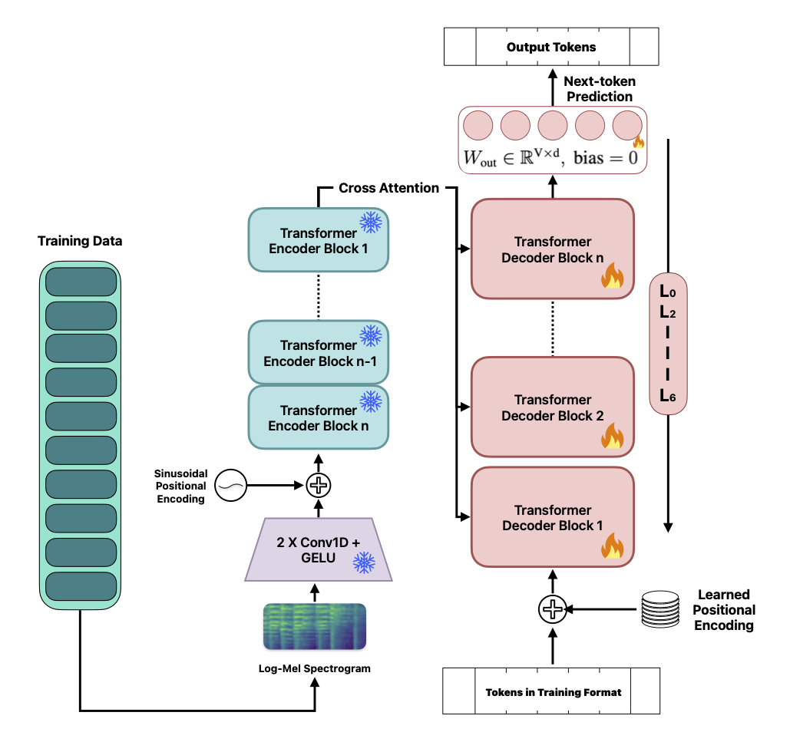

# Whisper decoder adaptation reproducibility code

This repository contains the training, evaluation, dataset preparation, and
statistical analysis code for the submitted study of decoder adaptation depth,
LoRA versus full fine-tuning, data scale, and optimisation budget in
Whisper-Medium ASR.

The manuscript evaluates English ASR adaptation on SPGISpeech 2.0, VoxPopuli-en,
and GigaSpeech-M. The main study compares decoder scopes L0, L2, L3, L4, L5,
and L6 with the encoder frozen; L1 is not evaluated. It also includes LoRA-rank
selection and L5 rank sensitivity, learning-rate sensitivity, an encoder-versus-
decoder control on VoxPopuli, convergence checks, computational-cost recording,
data-limited scaling, fixed-budget scaling, LibriSpeech OOD evaluation, and
paired bootstrap uncertainty estimates.

## Method overview



The encoder remains frozen in the main depth experiments while progressively
larger decoder scopes are adapted.

## Installation

Python 3.12 is supported. The runner scripts prefer the project Poetry
environment. Install the locked environment with:

```bash
poetry install --without dev
```

Hugging Face access may require accepted dataset terms and a local `HF_TOKEN`.
Keep credentials in `.env`; never commit them.

## Datasets and examples

The reported experiments use SPGISpeech 2.0, VoxPopuli-en, and GigaSpeech-M.
LibriSpeech test-clean and test-other are used for OOD evaluation. Settings are
documented in `docs/experiment_specification.md`. SPGISpeech requires external
shards and alignment files; set `SPGISPEECH2_ROOT` to that prepared corpus.

The four representative configurations in `configs/examples/` cover full
fine-tuning, decoder LoRA, OOD inference, and fixed-budget data scaling:

```bash
bash scripts/run_exp.sh configs/examples/lora.yaml
bash scripts/run_inf.sh configs/examples/inference_ood.yaml
```

Pass a second argument such as `0` to select a CUDA device. If the required
Python packages are missing, the scripts stop with the Poetry installation
command instead of launching a partial run.

The examples are intentionally generic. The manuscript’s exact depth, rank,
learning-rate, fraction, subset, seed, and regime settings are summarized in
`docs/experiment_specification.md`; the full experiment grid is not included.

Bootstrap analysis over completed run directories is run with:

```bash
python scripts/z1_bootstrap.py --scan outputs/rev
```

Statistical analysis consumes completed prediction and reference artifacts;
generated run artifacts are intentionally excluded here.

## Outputs and reproducibility

Training writes a run manifest, metrics, evaluation predictions, cost metadata,
and trainable weights beneath the configured output directory. Completed run
artifacts are authoritative for executed budgets. The executed GigaSpeech
full-data/fixed-budget setting was **42,489 steps**; references to 42,504 are
stale unless a completed artifact proves otherwise.

The main optimisation setting is AdamW with a linear schedule, learning rate
`1e-5`, warmup ratio `0.01`, weight decay `0.1`, batch size `16`, gradient
accumulation `1`, and FP16. Main LoRA runs use rank `64`, alpha `128`, and
dropout `0.1`; sensitivity runs vary rank or learning rate as described in the
experiment specification. Evaluation uses greedy English transcription with a
maximum of 200 generated tokens.

Experiments were designed for a single NVIDIA RTX A6000 with FP16 and batch
size 16. Runtime and memory depend on dataset, adaptation depth, and hardware.
Exact fractional subsets require the original dataset ordering and recorded
data-order seed. This repository does not ship checkpoints, logs, predictions,
or other generated run artifacts.
